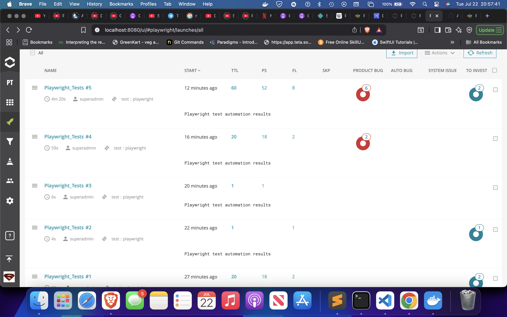

# ReportPortal Local Setup

A local ReportPortal server for test reporting and analytics.

## What is this?

ReportPortal is a web-based dashboard where you can view and analyze your test results. This setup runs ReportPortal locally on your computer using Docker.

## Quick Start

1. **Start ReportPortal:**
   ```bash
   docker-compose up -d
   ```

2. **Open in browser:**
   Go to http://localhost:8080

3. **Login:**
   - Username: `superadmin`
   - Password: `erebus`

4. **Stop ReportPortal:**
   ```bash
   docker-compose down
   ```

## What you get

- **Web dashboard** at http://localhost:8080
- **Test result storage** and analytics
- **Project management** for organizing tests
- **Real-time reporting** from your test runs

## Using with your tests

To send test results here from your test project:

1. Install ReportPortal client in your test project
2. Configure it to point to `http://localhost:8080/api/v1`
3. Use your project's API token (found in ReportPortal settings)
4. Run your tests - results will appear in the dashboard

## Requirements

- Docker and Docker Compose installed
- Ports 8080 and 8081 available

## Troubleshooting

- If login doesn't work, wait a few minutes for all services to start
- Check service status: `docker-compose ps`
- View logs: `docker-compose logs [service-name]`

